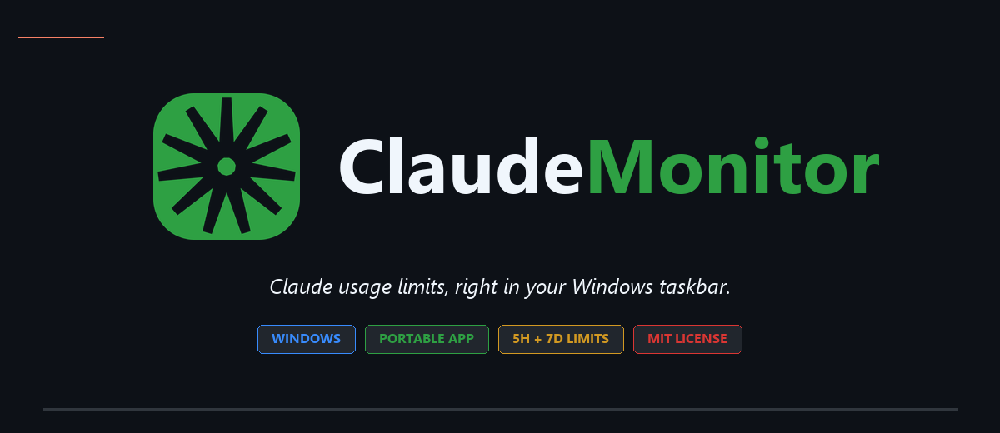
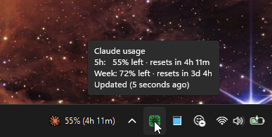

<div align="center">
  
  <p>
    <a href="https://github.com/kelpikz/ClaudeMonitor/releases/latest">Download for Windows</a>
    ·
    <a href="#installation-windows">Installation</a>
    ·
    <a href="https://github.com/kelpikz/ClaudeMonitor/issues">Report an issue</a>
  </p>
  <p>
    
    
    
  </p>
</div>

ClaudeMonitor is a lightweight Windows system-tray app that monitors your Claude usage limits at a glance. The tray icon changes color based on how much of your **5-hour** usage you have left. Hover the icon to see your current 5-hour and 7-day utilization and when each window resets.

<table align="center">
  <tr>
    <td align="center" width="25%"><strong>📦 Portable</strong><br />Download one executable.<br />No installer or Python required.</td>
    <td align="center" width="25%"><strong>🔐 Uses Claude Code</strong><br />Reads your existing local sign-in.<br />No API key setup.</td>
    <td align="center" width="25%"><strong>⏱ Live limits</strong><br />5-hour and 7-day windows,<br />reset times, and refresh.</td>
    <td align="center" width="25%"><strong>🧪 Tested</strong><br />340 automated tests<br />currently passing.</td>
  </tr>
</table>

## Preview

<p align="center">
  
</p>

## Installation (Windows)

ClaudeMonitor is distributed as a portable Windows executable. It does not require Python, `uv`, or a separate installer.

1. Install [Claude Code](https://docs.anthropic.com/en/docs/claude-code/overview) and sign in once. ClaudeMonitor reads the OAuth credentials created by Claude Code; it does not ask you to enter an API key.
2. Download `ClaudeMonitor.exe` from the [latest GitHub release](https://github.com/kelpikz/ClaudeMonitor/releases/latest).
3. Place the executable in a permanent folder, such as `%LOCALAPPDATA%\ClaudeMonitor`, and double-click it.
4. Look for the ClaudeMonitor icon in the Windows notification area. Right-click it and enable **Start with Windows** if you want it to launch automatically when you sign in.

On first launch, the app creates its settings file at `%APPDATA%\claudemonitor\config.toml`. Logs are stored at `%APPDATA%\claudemonitor\claudemonitor.log`.

### Updating or uninstalling

To update, quit ClaudeMonitor, replace the executable with the newer release, and launch it again. Your settings and logs are kept in `%APPDATA%\claudemonitor`.

To uninstall, quit the app and turn off **Start with Windows** first. Then delete the executable. You can also delete `%APPDATA%\claudemonitor` to remove settings and logs.

If Windows SmartScreen warns about an unsigned release, verify that the executable came from the official GitHub release page before choosing **More info** → **Run anyway**.

## Development

Requires [uv](https://docs.astral.sh/uv/).

| Command        | What it does                                              |
| -------------- | -------------------------------------------------------- |
| `uv run dev`   | Run the tray app in the foreground with console output   |
| `uv run poll`  | Fetch from the Anthropic API once, print the JSON, exit  |
| `uv run build` | Build `dist/ClaudeMonitor.exe` via PyInstaller           |

Logs are written to `%APPDATA%\claudemonitor\claudemonitor.log` (rotating, 1 MB × 3 files).

## Testing

Tests live in `tests/` and use [pytest](https://docs.pytest.org/).

```
uv run pytest
```

Run a single file or test:

```
uv run pytest tests/test_processor.py
uv run pytest tests/test_processor.py::TestProcessColors
```

## Running the built executable

After `uv run build`, launch the app:

```
dist\ClaudeMonitor.exe
```

The icon appears in the system tray (Windows taskbar notification area).
